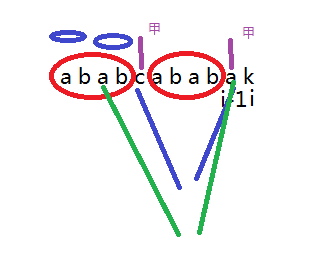
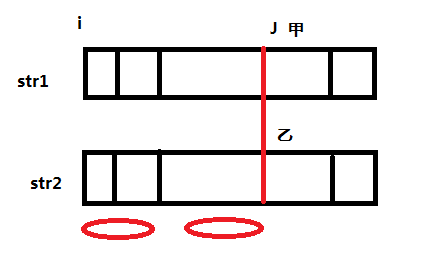
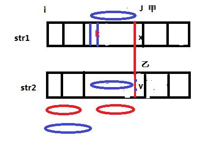
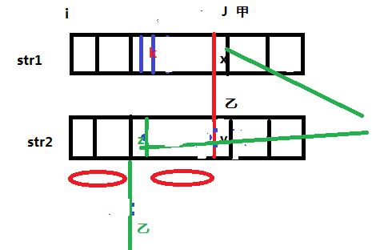

## KMP算法
先说什么是前缀和后缀，前缀和后缀是针对字符而言的如字符串abca`b`cab，前缀和后缀指的是b的前缀和后缀。

子串的前缀与后缀的概念：前缀就是不包括最后一个字符的字符串，后缀是不包括第一个字符的字符串如`b`的前缀是b之前的不包括`b`前面相邻的第一个a的所有子串，`a,ab,abc`，`b`的后缀为不包括开头第一个a的所有子串，`a,ca,bca`，再说最长前缀与最长后缀，最长前缀就是所有前缀中最常的那个，即`abc`，很显然后缀和前缀是有可能相等的，找出前缀和后缀相等的最长的子串，长度记为`length`，对整个字符串的每个字符都求出对应的`length`，再将这些length组成一个数组，对应原来字符串中字符的位置，这个数组就是next数组。人为规定next数组第一位为-1，第二位为0



next数组如何求也有简便的方法，从以上求解过程可以看出next数组是有规律可循的，要求i位置的next值，只需要看`i-1`位置上next值为多少，再看i-1位置和最长前缀后一个的字符是否相等，如果相等则i位置的next值为i-1位置的Next值加一，如果还有比这个更长的说明i-2有更长的前缀，也就说明i-1的next的值求的不对。
如果i-1的位置a和c不相等，那甲就移动到`C`,c所在位置也是a的next数组长度（因为数组是从0下标开始的）从c开始再来一遍，即图中绿色部分，i位置的next值等于甲位置的next值`加一`

给出两个字符串str1,str2,求str1中含有几个str2，很显然str1比str2要长
首先求出str2对应的next数组



如图str1和str2从第一个位置开始匹配，在红线之前都匹配红线之后不匹配，str2的next数组对应的前缀和后缀用红圈表示，当不匹配之后str2应该从1位置开始再匹配，但0位置到J位置之间的任何一个位置开始都不可能再匹配



假如能从k开始匹配，则说明k到x这段蓝色部分对用str2中Y之前这一段蓝色部分，同时也对应str2从开始长蓝色的部分，说明str2中J位置的最长前缀为蓝色部分，比红色部分next数组的最长前缀长,而next数组求的最长前缀是绝对正确的，说明假设不成立，
只能从j位置开始匹配，甲乙指针分别表示当前的指向的位置




此时甲指针不动，`乙指针`回退到红色部分即next数组对应的值,即图中绿色部分，比对x和z是否相等，因为X和Y之前的部分是相等的，所以此时x之前的部分为最长前缀，z之前也为最长前缀，两者是相等的，`省去了匹配`，直接从x和z开始匹配，如果不匹配再从乙的next数组开始回退，这就是整个kmp算法的过程。
```c++
#include <iostream>
#include <cstring>
#include<vector>
#define debug(); cout<<__LINE__<<endl;
using namespace std;
//-1 -1 0 1 2 -1 0 -1 
//10    
        
const char *str1 = "bacbababadababacambabacadababacaasdsd";
const char *str2 = "ababaca";
int *next = new int[sizeof(str2)]; 
        
void Get_next() //求next数组，封装成函数
{                       
        int len = sizeof(str2);
        next[0] = -1;//人为规定next数组第一位为-1，第二位为0
        int j = -1;     //即上图的甲指针
 
        for(int i = 1; i < len; ++i)
        {               
                while(j > -1 && str2[i] != str2[j+1]) //不等j回退到i-1的next值
                        j = next[j];
 
                if( str2[i] == str2[j+1] ) // 相等子串j加加
                        j++;
                next[i] = j;
        }
 		cout<<"next数组为："; 
        for(int i = 0; i < len; ++i)
                cout << next[i] << ' ';
                cout << endl;
}
 
vector<int > KMP( )
{
        Get_next();
        int s_len = strlen(str1);
        int p_len = strlen(str2);
        int j  = -1;
        vector<int > res;
        for(int i = 0; i < s_len; ++i)
        {
                while(j > -1 && str2[j+1] != str1[i]) //j指针还能退，且两个字符不相等，j就后退
                        j = next[j];
        
                if(str2[j+1] == str1[i]) 
                        j++;    //等子串就加一
        
                if(j == p_len-1) {
						res.push_back(i-p_len+1); //子串走到头，匹配的位置记录下来 
						j=-1;                  //j从头开始，再次匹配下一个 
                        
                }
        }
        return res;
}                       
                
int main( )
{		
		vector<int > result = KMP( );
        cout<<"总共含有"<<result.size()<<"个子串"<< endl;  //总共含有的子串的个数 
        vector<int >::iterator it;
        cout<<"每个子串开始的位置："<<" ";
        for(it = result.begin();it != result.end(); ++it)
    	{
        	cout<<*it<<" ";  //输出每个开始匹配的位置 
    	}
		cout<<endl;
}
```
原文链接：https://blog.csdn.net/pursue_my_life/article/details/80028050


int * getnextarray(string str2){
        if(str2.length == 1)
        return new int * {-1};
        int * next = new int[str2.length];
        next[0] = -1;
        next[1] = 0;
        int i = 2;
        int cn = 0;
        while(i<next.length>){
                if(str2[i-1] == str2[cn]){
                        next[i++] =  ++cn;
                }else if(cn > 0){
                        cn = next[cn];
                }else{
                        next[i++] = 0;
                }
        }
        return next;
}
int getindexof(string s,string m){
        if(s==NULL || m == null || m.length()<1 || s.length()<m.legth()){
                return -1;
        }
        string str1;
        string str2;
        int i1 = 0;
        int i2 = 0;
        int * next = getnextarray(str2);
        while(i1<str1.length && i2 < str2.length){
                if(str1[i1]==str2[i2]){
                        i1++;
                        i2++;
                }else{
                        if(next[i2]==-1){
                                i1++;
                        }else{
                                i2 = next[i2];
                        }
                }
                return i2 == str2.length ? i1-i2:-1;
        }
}