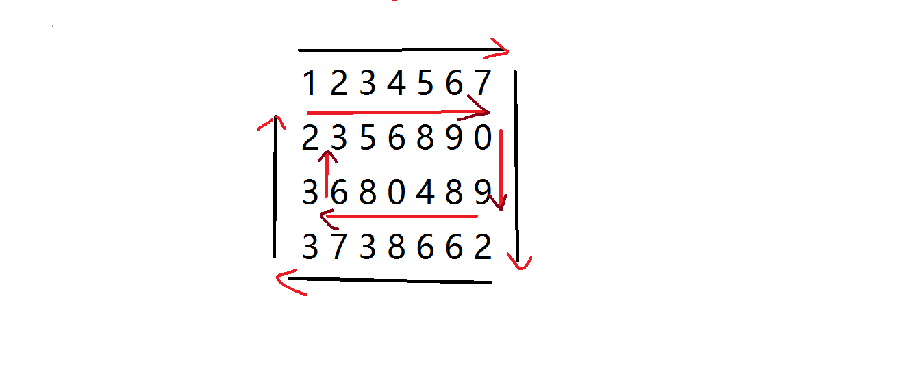

### 题目如下：
>给出一个二维数组，按照顺时针方向从外到内依次打印数组中的元素。
### 分析：

按照常规的方法，控制数组的边界，打印到行或列的末尾就改变方向，整个算法就是抠边界，虽说能做出来但抠边界太过于仔细，过程中发生的情况太多。

  换一种思路从全局来看，就是一圈一圈的重复顺时针的移动,设置两个起点，一个在左上角`p(row1,col1)`，一个在右下角`q(row2,col2)`。`p`和`q`给定之后值就不再改变，通过别名的方式来移动，左上角的先走，向右先走列，直到等于右下角的列号`col2`，列号相等之后再向下走行，直到等于右下角的行号`row2`,接着右下角的开始向左走，直到等于左上角的列号`col1`,接着向上走直到等于左上角的行号`row1`,这样一来一圈走完，左下角`p`和右下角`q`同时移动到内圈的左上角和右下角，`p(row1++,col1++)``q(row2--,col2--)`直到 `row1<=row2` 或 `col1==col2`。
  

### 完整代码：
```c++
#include<iostream>
using namespace std;
void circle(int a[3][4],int row1,int col1,int row2,int col2)
{
	if(row1==row2)
	{
		for(int i=col1;i<=col2;i++)
		{
			cout<<a[row1][i]<<"  ";
		}
	}else if(col1==col2)
		{
			for (int i=row1;i<=row2;i++)
			{
				cout<<a[i][col1]<<"  ";
			}
		}
	else
	{
		int currow=row1;
		int curcol=col1;
		while(curcol != col2)
		{
			cout<<a[row1][curcol++]<<"  ";
		}
		while(currow != row2)
		{
			cout<<a[currow++][col2]<<"  ";
		}
		while(curcol != col1)
		{
			cout<<a[row2][curcol--]<<"  ";
		}
		while(currow != row1)
		{
			cout<<a[currow--][col1]<<"  ";
		}
    }
}

int main ()
{
	int a[3][4]={1,2,3,4,5,6,7,8,1,9,0,3};
	int row1=0;
	int col1=0;
	int row2=2;
	int col2=3;
	while(row1<=row2 || col1<=col2)
	{
		circle(a,row1++,col1++,row2--,col2--);/*向内压缩过程在此发生*/
	}
}
```